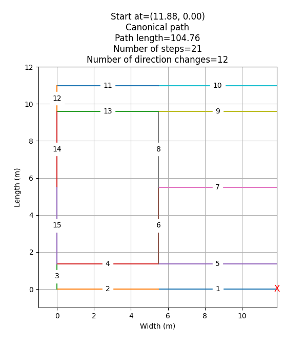

# How to wipe the lines of a tennis court in an optimized way

Every time when I wipe the lines of a tennis court I asked myself: what would be the optimal path in order to do that?

Therefore, I wrote a program which calculated it.

The program assumes that you could start at different points of the court. It assumes also that you must return to that
point before you're finished.

## Results

The following images show half of a tennis court. The red "X" marks the start and end point. The numbers in the lines
are the order of the lines that have to be wiped.

### Start at the net (side)


### Start at the middle (side)


### Start at the baseline (side)


### Start at the baseline (middle)


### How I did it before I knew better




## Tennis court dimensions


## How to run

Only tested on Windows (and PyCharm on Windows).

### Install

In order to make this script runnable, follow the installation instructions which has to be executed only once.

#### Venv

Import Virtual environment (Venv) in Windows to this project folder:

- Open cmd.exe
  ```shell
  cd C:\PATH_TO_THIS_PYTHON_PROJECT
  @REM Install virtualenv
  pip3 install virtualenv 
  @REM Create a virtual environment with subdirectory 'venv'
  virtualenv venv
  @REM Activate venv
  venv\Scripts\activate.bat
  pip3 install -r src\main\resources\venv-requirements.txt --no-deps
  ```

### Run

- Open cmd.exe

```shell
.\venv\Scripts\python.exe .\src\main\python\main.py
```

## Implementation details

### Algorithm

The lines of the tennis court are stored in an array. Each item contains a start and an end point as a coordinate. The
starting point of the baseline on the right has the coordinates (0, 0).

The algorithm starts at a given coordinate and iterates through all possible points of the array. When it turns out that
the current path is less optimal than the latest calculated optimized path, the path is pruned by the
method `prunePath()` in `LineWalker.py`. If a new optimized path is found which is better as the one before, it
replaces the previous one. As there's no calculated optimized path in the beginning of the algorithm,
the canonical path is assumed to be the best path.

There are several solutions with the same path length. The path with the least number of direction changes is taken in
the end.

The results are cached in the target directory and will be used in a second run.

The result is displayed with the library matplotlib.

Several constants in `TennisCourtWipeOptimization.py` configure the behaviour of this program.

### Venv dependency list

Venv dependency list was generated by:

- Open cmd.exe
  ```shell
  cd C:\PATH_TO_THIS_PYTHON_PROJECT
  venv\Scripts\activate.bat
  mkdir src\main\resources
  pip3 freeze list > src\main\resources\venv-requirements.txt
  ```

### Calculation time

Calculation time (on my machine): about 1 h 20 m (about 20 minutes for each starting point). The calculation for each
starting point runs from scratch. It does not "learn" from the previous run ('cause I don't know how).

## My benefit

It turned out that I did it horribly wrong all the time. With the new results I can spare about 10 m!

Assuming that I crawl with 3 km/h (after a tennis match, I am really exhausted) over the court in order to wipe the
lines, I spare about 14 seconds each time! Assuming that I spend about 20 hours on this project, the break even point is
after 5.142 times wiping the lines. That's good news because it means that I will play a lot of tennis!